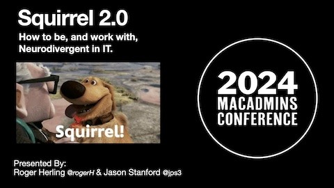

# Squirrel 2.0

 
[Click Here for the Presentation](https://github.com/rherling/Squirrel2/edit/main/squirrel2.pdf) 

- - - 

## Learning, Help, and Information

  
[https://www.additudemag.com/](additudemag-logo-red.svg)

Some suggested starting point categories: [ADDitude for Professionals](https://www.additudemag.com/category/adhd-professionals/), [Getting Things Done](https://www.additudemag.com/category/manage-adhd-life/getting-things-done/time-productivity/), [ADHD in Women](https://www.additudemag.com/category/adhd-add/adhd-in-adults/add-women/), [The ADHD Brain](https://www.additudemag.com/category/adhd-add/adhd-brain/), _many others available_

- - - 

  
[https://try.getinflow.io/quiz-homepage/](https://try.getinflow.io/quiz-homepage/)

“Inflow is [a] science-based app to help you manage your ADHD. Created by ADHD clinicians and psychologists, [it] helps you understand your neurodivergent brain, build lifelong skills, and get things done.”

- - - 

### YouTube Channels

- Mostly about neurodiversity, ADHD, or ASD:
    - …
- Not specifically about neurodiversity, ADHD, or ASD:
    - [Dr. Tracey Marks](https://www.youtube.com/@DrTraceyMarks) — “I am a psychiatrist in Atlanta with over 20 years experience. This channel teaches you about mental health issues and self-improvement. Why? Because education empowers.”
    - [Dr. Scott Eilers](https://www.youtube.com/@DrScottEilers) — “My goal for this channel is to put the highest quality information about depression and anxiety in the hands of the people who need it most; those who are living with it every day.”
    - [Therapy in a Nutshell](https://www.youtube.com/@TherapyinaNutshell) — “… my mission is to make mental health resources easier to access. I take therapy skills and psychological research and condense them down into bite-sized nuggets of help.”
